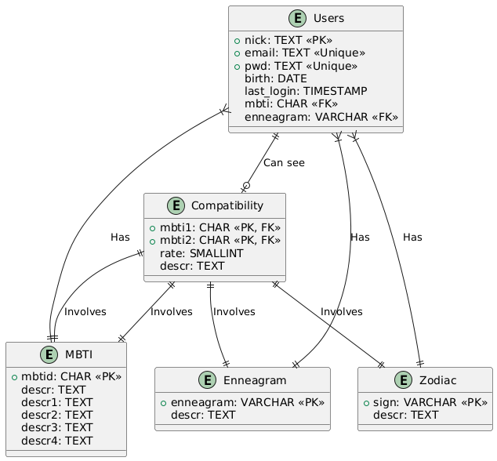

# Diagramma di entità-relazione

## Relazioni:
- Users è associato a MBTI, Enneagram e Zodiac tramite chiavi esterne (FK).
- Compatibility è associato a Users (due volte, per `mbti1` e `mbti2`).

## Chiavi primarie (PK):
Ogni entità che ha una chiave primaria ha il tag `<<PK>>` accanto al nome del campo corrispondente. Ad esempio `mbtid` in MBTI, `sign` in Zodiac, `enneagram` in Enneagram, e `nick` in Users.

## Chiavi esterne (FK):
Le chiavi esterne sono indicate con `<<FK>>`. Ad esempio `mbti` e `enneagram` in Users sono chiavi esterne che si collegano rispettivamente a MBTI e Enneagram. Anche i campi `mbti1` e `mbti2` in Compatibility sono sia chiavi primarie che chiavi esterne, quindi sono contrassegnati con `<<PK, FK>>`.

## Chiavi uniche (Unique):
I campi che devono essere unici, come `email` e `pwd` in Users, sono contrassegnati con `<<Unique>>`.