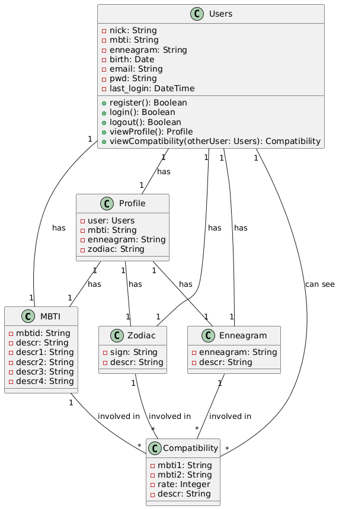

# Diagramma di classi

## Le classi:
-User: La classe rappresenta l'utente, con attributi come `username`, `password` e etc. Ha metodi per registrarsi, fare login, fare logout, visualizzare il profilo e vedere la compatibilità con altri utenti.
-Profile: La classe che rappresenta il profilo di un utente, con informazioni come il tipo di MBTI, il tipo di Enneagram e il segno zodiacale.
-Compatibility: Classe che gestisce la compatibilità tra due utenti, dove viene visualizzata la percentuale di compatibilità.
-MBTI, Enneagram, Zodiac: Classi che rappresentano le pagine relative a MBTI, Enneagram e Zodiac.