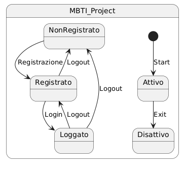

# Diagramma di stato

L'utente inizia nello stato di Non Registrato, quindi può passare attraverso le varie transizioni come Registrazione o Login.
Abbiamo tre stati:
- Non Registrato: Lo stato iniziale in cui l'utente non ha un account.
- Registrato: Lo stato in cui l'utente si è registrato ma non ha ancora effettuato il login.
- Loggato: Lo stato in cui l'utente è autenticato dopo il login.

Transizioni:
- Registrazione: Un utente non registrato può passare allo stato "Registrato" tramite la registrazione.
- Login: Un utente registrato può effettuare il login e passare allo stato "Loggato".
- Logout: Un utente loggato può fare il logout e tornare allo stato "Registrato" o "Non Registrato".
- Accesso alle pagine: L'utente, sia registrato che non registrato, può sempre visualizzare le pagine MBTI, Enneagram e Zodiac. Questa azione può essere eseguita in ogni stato.
- Visualizzare il profilo: Solo l'utente registrato e loggato può visualizzare il proprio profilo.
- Confronto personalità: Solo un utente loggato può fare un confronto tra le varie personalità.

